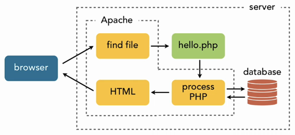

# PHP

## Opdracht 1 - Installatie

> 1. Fork dit project naar je eigen Github repositories
> 2. Clone dit project naar een lokale (niet Onedrive) map met `git clone ....`
> 3. Open het project in VS Code
> 4. Open een terminal en type `docker compose up`
> 5. Open je browser en ga naar http://localhost/
> 6. Open PHPMyAdmin door in je browser te gaan naar http://localhost:8000

## Opdracht 2 - Database

> 1. Maak gebruik van de database genaamd `computerstore` in PHPMyAdmin.
> 2. Importeer of kopieer de [manufacturers.sql](sql/manufacturers.sql) gegevens in de database.


## Opdracht 3 - Database connectie

> 1. Maak een bestand genaamd [database.php](www/database.php).
> 2. Maak eerst database connectie, gebruik de code van Moodle of [Github Cheatsheet](https://github.com/NOVA-college-Haarlem/Mysqli-cheatsheet)

## Opdracht 4 - Toon de gegevens
> 1. In het bestand [manufacturers_index.php](www/manufacturers_index.php) schrijf je code om een de database connectie te *importeren*.
> 2. Maak een iteratie met een foreach loop om zo de gegevens in de browser te tonen.
> 3. Laat het resultaat aan de docent zien.

## Theorie

### Database Connectie



Als je goed kijkt naar de afbeelding van de Request Response Cycle dan zie je dat een PHP pagina kan communiceren met een database. Dat gaan we nu regelen. Er zijn verschillende manieren om dit te doen. Wij beginnen uiteraard met de eenvoudige wijze.

Je begint met het maken van een database.php bestand en je zet onderstaande code erin.
```php
<?php
// Database configuratie
$host  = "localhost";
$dbuser = "root";
$dbpass = "";
$dbname = "GFG"; //pas de naam van de database aan naar computerwinkel

// Maak een  database connectie
$conn = mysqli_connect($host, $dbuser, $dbpass, $dbname);

// TL;DR; De $conn variabele bevat de gehele connectie

```

Je kunt de controleren of de connectie gelukt is:
```php
// Controleer de verbinding
if(mysqli_connect_error())
{
 echo "Er is iets fout gegaan met de connnectie, check je settings";
}
else
{
 echo "De connectie is gelukt! Doe nu een dansje!";
}
```

Je dient uiteraard de instellingen aan te passen aan het project(je) waar je mee aan het werk bent

### Data ophalen

Nu je een succesvolle database connectie hebt moet je een query uitvoeren op de database tabel. Dit heb je al gedaan bij al je database lessen maar dan via PHPMYADMIN. Nu gaan we dat met PHP doen, je maakt bijvoorbeeld een pagina genaamd overzicht-gebruikers.php

```php
<?php
//importeer de gegevens van de database
require 'database.php';

//de sql query
$sql = "SELECT * FROM users";

//hier wordt de query uitgevoerd met de database
$result = mysqli_query($conn,$sql);

/**
 * Hier wordt het resultaat ($result) omgezet
 * in een *multidimensionale associatieve array
 * in dit voorbeeld staat $all_users maar dit mag
 * voor bijvoorbeeld producten $all_products heten.
 * Maar dit kies je zelf
 */
$all_users = mysqli_fetch_all($result, MYSQLI_ASSOC);

/**
 * Hier loop (iterate) je over alle waardes die gevonden zijn.
 * Je kunt zoals je zien paragraaf-tags gebruiken
 * maar je kunt ook andere HTML-**tags** gebruiken
 */
?>
<?php foreach($users as $user): ?>
  <p><?php echo $user["voornaam"] ?></p>
<?php endforeach; ?>
```

